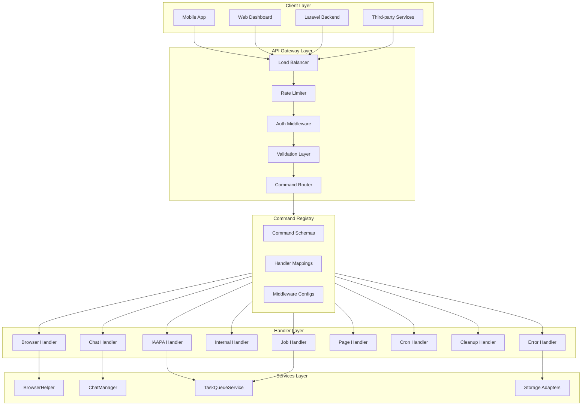
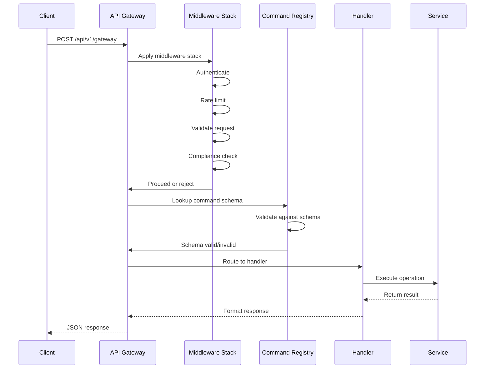
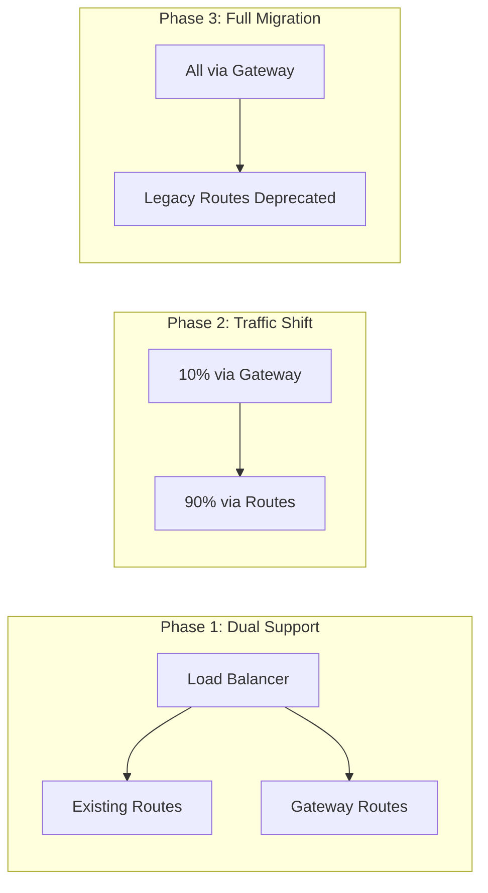

# Unified API Gateway Architecture Design

## Executive Summary

This document outlines the design for a unified API Gateway that consolidates multiple specialized endpoints into a single, scalable API entry point. The gateway uses a command-based request structure that supports routing to appropriate handlers based on operation type.

**Current State:** 9 specialized controllers with 9 route files  
**Target State:** Single gateway endpoint with extensible command registry

---

## 1. Architecture Overview

### 1.1 High-Level Architecture Diagram



### 1.2 Request Flow



---

## 2. Command Registry Schema

### 2.1 Core Command Types

```typescript
// types/gateway/commands.ts

/**
 * Unified Command Interface
 * All commands sent to the gateway must conform to this structure
 */
export interface GatewayCommand {
  /** Unique command identifier */
  commandId: string;

  /** Command type (maps to handler) */
  type: CommandType;

  /** API version for forward compatibility */
  version: 'v1';

  /** Command payload specific to type */
  payload: CommandPayload;

  /** Request metadata */
  metadata?: CommandMetadata;
}

/**
 * Available command types
 */
export enum CommandType {
  // Browser Commands
  BROWSER_EXECUTE = 'browser.execute',
  BROWSER_SEARCH = 'browser.search',
  BROWSER_VISIT = 'browser.visit',
  BROWSER_SCRAPE = 'browser.scrape',
  BROWSER_DOWNLOAD = 'browser.download',
  BROWSER_VIEW = 'browser.view',

  // Chat Commands
  CHAT_PREPARE = 'chat.prepare',
  CHAT_MESSAGE = 'chat.message',
  CHAT_MESSAGE_GPT = 'chat.message_gpt',

  // IAAPA Commands
  IAAPA_RUN_ALL = 'iaapa.run_all',
  IAAPA_STATUS = 'iaapa.status',
  IAAPA_DOWNLOAD_CSV = 'iaapa.download_csv',

  // Internal Commands
  INTERNAL_PING = 'internal.ping',
  INTERNAL_REQUEST_WORK = 'internal.request_work',
  INTERNAL_SUBMIT_RESULT = 'internal.submit_result',
  INTERNAL_QUEUE_STATS = 'internal.queue_stats',
  INTERNAL_QUEUE_ENQUEUE = 'internal.queue_enqueue',

  // Job Commands
  JOB_CREATE = 'job.create',

  // Page Commands
  PAGE_LIST = 'page.list',
  PAGE_REQUEST = 'page.request',
  PAGE_CLOSE = 'page.close',

  // Cron Commands
  CRON_CLEANUP_PAGES = 'cron.cleanup_pages',
  CRON_STATS = 'cron.stats',

  // Cleanup Commands
  CLEANUP_EXECUTE = 'cleanup.execute',
  CLEANUP_STATS = 'cleanup.stats',

  // Error Commands
  ERROR_REPORT = 'error.report',
}

/**
 * Command payload union - each command type has specific payload
 */
export type CommandPayload =
  | BrowserExecutePayload
  | BrowserSearchPayload
  | BrowserVisitPayload
  | BrowserScrapePayload
  | BrowserDownloadPayload
  | BrowserViewPayload
  | ChatPreparePayload
  | ChatMessagePayload
  | ChatMessageGPTPayload
  | IaapaRunAllPayload
  | IaapaStatusPayload
  | IaapaDownloadCsvPayload
  | InternalPingPayload
  | InternalRequestWorkPayload
  | InternalSubmitResultPayload
  | InternalQueueStatsPayload
  | InternalQueueEnqueuePayload
  | JobCreatePayload
  | PageListPayload
  | PageRequestPayload
  | PageClosePayload
  | CronCleanupPagesPayload
  | CronStatsPayload
  | CleanupExecutePayload
  | CleanupStatsPayload
  | ErrorReportPayload;

/**
 * Request metadata
 */
export interface CommandMetadata {
  /** Client-provided request ID for idempotency */
  requestId?: string;

  /** Client timestamp */
  clientTimestamp?: string;

  /** Callback URL for async operations */
  callbackUrl?: string;

  /** Priority level (1-10, default 5) */
  priority?: number;

  /** Request context */
  context?: RequestContext;
}

/**
 * Request context
 */
export interface RequestContext {
  /** Client IP address */
  ip?: string;

  /** User agent */
  userAgent?: string;

  /** Source platform */
  source?: string;

  /** Correlation ID for distributed tracing */
  correlationId?: string;
}
```

### 2.2 Browser Command Payloads

```typescript
// types/gateway/browser-commands.ts

import { z } from 'zod';

/**
 * Browser execute payload
 */
export interface BrowserExecutePayload {
  code: string;
  timeout?: number;
}

export const browserExecuteSchema = z.object({
  code: z.string().min(1).max(10000),
  timeout: z.number().positive().max(60000).optional(),
});

/**
 * Browser search payload
 */
export interface BrowserSearchPayload {
  query: string;
  numResults?: number;
}

export const browserSearchSchema = z.object({
  query: z.string().min(1).max(500),
  numResults: z.number().positive().max(20).optional(),
});

/**
 * Browser visit payload
 */
export interface BrowserVisitPayload {
  url: string;
  options?: {
    waitUntil?: 'load' | 'domcontentloaded' | 'networkidle' | 'commit';
    timeout?: number;
    returnHtml?: boolean;
    saveToFile?: boolean;
    handleCloudflare?: boolean;
    useProgressiveRetry?: boolean;
  };
}

export const browserVisitSchema = z.object({
  url: z.string().url().startsWith('http'),
  options: z
    .object({
      waitUntil: z.enum(['load', 'domcontentloaded', 'networkidle', 'commit']).optional(),
      timeout: z.number().positive().max(300000).optional(),
      returnHtml: z.boolean().optional(),
      saveToFile: z.boolean().optional(),
      handleCloudflare: z.boolean().optional(),
      useProgressiveRetry: z.boolean().optional(),
    })
    .optional(),
});

/**
 * Browser scrape payload
 */
export interface BrowserScrapePayload {
  url: string;
  vendor: string;
}

export const browserScrapeSchema = z.object({
  url: z.string().url().startsWith('http'),
  vendor: z.string().min(1).max(100),
});

/**
 * Browser download payload
 */
export interface BrowserDownloadPayload {
  fileId: string;
}

export const browserDownloadSchema = z.object({
  fileId: z.string().min(1),
});

/**
 * Browser view payload
 */
export interface BrowserViewPayload {
  fileId: string;
}

export const browserViewSchema = z.object({
  fileId: z.string().min(1),
});
```

### 2.3 Chat Command Payloads

```typescript
// types/gateway/chat-commands.ts

import { z } from 'zod';

/**
 * Chat prepare payload
 */
export interface ChatPreparePayload {
  model?: 'gemini' | 'default';
}

export const chatPrepareSchema = z.object({
  model: z.enum(['gemini', 'default']).optional(),
});

/**
 * Chat message payload
 */
export interface ChatMessagePayload {
  prompt: string;
  sessionId?: string;
  options?: {
    stream?: boolean;
    temperature?: number;
    maxTokens?: number;
  };
}

export const chatMessageSchema = z.object({
  prompt: z.string().min(1).max(10000),
  sessionId: z.string().optional(),
  options: z
    .object({
      stream: z.boolean().optional(),
      temperature: z.number().min(0).max(1).optional(),
      maxTokens: z.number().positive().max(8192).optional(),
    })
    .optional(),
});

/**
 * ChatGPT message payload
 */
export interface ChatMessageGPTPayload {
  prompt: string;
  sessionId?: string;
  options?: {
    model?: string;
    temperature?: number;
    maxTokens?: number;
  };
}

export const chatMessageGPTSchema = z.object({
  prompt: z.string().min(1).max(10000),
  sessionId: z.string().optional(),
  options: z
    .object({
      model: z.string().optional(),
      temperature: z.number().min(0).max(1).optional(),
      maxTokens: z.number().positive().max(8192).optional(),
    })
    .optional(),
});
```

### 2.4 Job Command Payloads

```typescript
// types/gateway/job-commands.ts

import { z } from 'zod';

/**
 * Job create payload
 */
export interface JobCreatePayload {
  jobId?: string;
  target: {
    url: string;
    metadata?: Record<string, unknown>;
    lead?: Record<string, unknown>;
  };
  parser: {
    slug: string;
    mode: 'single' | 'batch' | 'vendor';
    definition?: Record<string, unknown>;
  };
  callbackUrl?: string;
}

export const jobCreateSchema = z.object({
  jobId: z.string().optional(),
  target: z.object({
    url: z.string().url().startsWith('http'),
    metadata: z.record(z.unknown()).optional(),
    lead: z.record(z.unknown()).optional(),
  }),
  parser: z.object({
    slug: z.string().min(1),
    mode: z.enum(['single', 'batch', 'vendor']),
    definition: z.record(z.unknown()).optional(),
  }),
  callbackUrl: z.string().url().optional(),
});
```

### 2.5 Internal Command Payloads

```typescript
// types/gateway/internal-commands.ts

import { z } from 'zod';

/**
 * Internal ping payload (for Laravel communication)
 */
export interface InternalPingPayload {
  timestamp?: number;
}

export const internalPingSchema = z.object({
  timestamp: z.number().optional(),
});

/**
 * Internal request work payload
 */
export interface InternalRequestWorkPayload {
  maxTasks?: number;
}

export const internalRequestWorkSchema = z.object({
  maxTasks: z.number().positive().max(50).optional(),
});

/**
 * Internal submit result payload
 */
export interface InternalSubmitResultPayload {
  taskId: string;
  success: boolean;
  result?: unknown;
  error?: string;
  executedAt?: string;
  durationMs?: number;
}

export const internalSubmitResultSchema = z.object({
  taskId: z.string().min(1),
  success: z.boolean(),
  result: z.unknown().optional(),
  error: z.string().optional(),
  executedAt: z.string().optional(),
  durationMs: z.number().positive().optional(),
});

/**
 * Internal queue stats payload
 */
export interface InternalQueueStatsPayload {
  includeWorkers?: boolean;
}

export const internalQueueStatsSchema = z.object({
  includeWorkers: z.boolean().optional(),
});

/**
 * Internal queue enqueue payload
 */
export interface InternalQueueEnqueuePayload {
  tasks: Array<{
    id: string;
    type: string;
    url: string;
    payload?: Record<string, unknown>;
  }>;
}

export const internalQueueEnqueueSchema = z.object({
  tasks: z.array(
    z.object({
      id: z.string().min(1),
      type: z.string().min(1),
      url: z.string().url().startsWith('http'),
      payload: z.record(z.unknown()).optional(),
    })
  ),
});
```

---

## 3. Command Registry Implementation

### 3.1 Registry Structure

```typescript
// gateway/command-registry.ts

import { z } from 'zod';
import type { GatewayCommand, CommandType, CommandPayload } from '../types/gateway/commands';
import type { Request, Response, NextFunction } from 'express';

/**
 * Command handler interface
 */
export interface CommandHandler {
  (command: GatewayCommand, req: Request): Promise<CommandResponse>;
}

/**
 * Command response interface
 */
export interface CommandResponse {
  success: boolean;
  data?: unknown;
  error?: CommandError;
  metadata?: {
    commandId: string;
    processedAt: string;
    durationMs: number;
  };
}

/**
 * Command error interface
 */
export interface CommandError {
  code: string;
  message: string;
  details?: Record<string, unknown>;
}

/**
 * Command registry entry
 */
export interface CommandRegistryEntry {
  type: CommandType;
  schema: z.ZodSchema<CommandPayload>;
  handler: CommandHandler;
  middleware?: string[];
  rateLimit?: {
    windowMs: number;
    maxRequests: number;
  };
  hipaaCompliant?: boolean;
  version: string;
  deprecated?: boolean;
  deprecationMessage?: string;
}

/**
 * Command Registry
 * Central registry for all supported commands
 */
export class CommandRegistry {
  private registry: Map<CommandType, CommandRegistryEntry> = new Map();
  private aliases: Map<string, CommandType> = new Map();

  /**
   * Register a command
   */
  register(entry: CommandRegistryEntry): void {
    this.registry.set(entry.type, entry);

    // Create alias for backward compatibility
    const alias = entry.type.replace(/\./g, '_').toUpperCase();
    this.aliases.set(alias, entry.type);
  }

  /**
   * Get command entry
   */
  get(type: CommandType): CommandRegistryEntry | undefined {
    return this.registry.get(type);
  }

  /**
   * Get command by type or alias
   */
  resolve(typeOrAlias: string): CommandRegistryEntry | undefined {
    // Direct lookup
    const entry = this.registry.get(typeOrAlias as CommandType);
    if (entry) return entry;

    // Alias lookup
    const alias = this.aliases.get(typeOrAlias.toUpperCase());
    if (alias) return this.registry.get(alias);

    return undefined;
  }

  /**
   * Get all commands
   */
  getAll(): CommandRegistryEntry[] {
    return Array.from(this.registry.values());
  }

  /**
   * Get non-deprecated commands
   */
  getActive(): CommandRegistryEntry[] {
    return Array.from(this.registry.values()).filter(e => !e.deprecated);
  }

  /**
   * Get commands by category
   */
  getByCategory(category: string): CommandRegistryEntry[] {
    return Array.from(this.registry.values()).filter(e => e.type.startsWith(category));
  }

  /**
   * Check if command exists
   */
  has(type: CommandType): boolean {
    return this.registry.has(type);
  }

  /**
   * Get supported types
   */
  getSupportedTypes(): CommandType[] {
    return Array.from(this.registry.keys());
  }
}

/**
 * Global command registry instance
 */
export const commandRegistry = new CommandRegistry();
```

### 3.2 Command Router

```typescript
// gateway/command-router.ts

import { Request, Response, NextFunction } from 'express';
import { commandRegistry, CommandHandler, CommandResponse } from './command-registry';
import type { GatewayCommand } from '../types/gateway/commands';
import { ValidationError } from '../types/errors';
import { logErrorToDB } from '../utils/errorLogger';

/**
 * Command Router
 * Routes commands to appropriate handlers
 */
export class CommandRouter {
  /**
   * Create Express middleware for command routing
   */
  createMiddleware() {
    return async (req: Request, res: Response, next: NextFunction): Promise<void> => {
      const startTime = Date.now();

      try {
        // Parse and validate gateway command
        const command = this.parseCommand(req.body);

        // Lookup command in registry
        const entry = commandRegistry.resolve(command.type);

        if (!entry) {
          throw new UnknownCommandError(command.type);
        }

        if (entry.deprecated) {
          console.warn(`[CommandRouter] Using deprecated command: ${command.type}`);
          res.set('X-Deprecation-Warning', 'true');
          if (entry.deprecationMessage) {
            res.set('X-Deprecation-Message', entry.deprecationMessage);
          }
        }

        // Validate payload against schema
        const validationResult = entry.schema.safeParse(command.payload);

        if (!validationResult.success) {
          throw new ValidationError('Invalid command payload', {
            errors: validationResult.error.errors.map(e => ({
              field: e.path.join('.'),
              message: e.message,
            })),
          });
        }

        // Execute handler
        const response = await entry.handler(command, req);

        // Add metadata
        response.metadata = {
          commandId: command.commandId,
          processedAt: new Date().toISOString(),
          durationMs: Date.now() - startTime,
        };

        // Send response
        res.json(response);
      } catch (error) {
        await this.handleError(error as Error, req, res, next);
      }
    };
  }

  /**
   * Parse command from request body
   */
  private parseCommand(body: unknown): GatewayCommand {
    if (!body || typeof body !== 'object') {
      throw new ValidationError('Invalid request body');
    }

    const data = body as Record<string, unknown>;

    if (!data.type || typeof data.type !== 'string') {
      throw new ValidationError('Missing command type');
    }

    if (!data.payload || typeof data.payload !== 'object') {
      throw new ValidationError('Missing command payload');
    }

    return {
      commandId: (data.commandId as string) || this.generateCommandId(),
      type: data.type as GatewayCommand['type'],
      version: (data.version as GatewayCommand['version']) || 'v1',
      payload: data.payload as CommandPayload,
      metadata: data.metadata as GatewayCommand['metadata'],
    };
  }

  /**
   * Generate unique command ID
   */
  private generateCommandId(): string {
    return `cmd_${Date.now()}_${Math.random().toString(36).slice(2, 11)}`;
  }

  /**
   * Handle errors
   */
  private async handleError(error: Error, req: Request, res: Response, next: NextFunction): Promise<void> {
    console.error('[CommandRouter] Error processing command:', error);

    await logErrorToDB({
      type: 'COMMAND_ROUTER_ERROR',
      message: error.message,
      stack: error.stack,
      route: '/api/gateway',
      input: req.body,
    });

    const errorResponse = this.formatError(error);
    res.status(errorResponse.statusCode || 500).json(errorResponse.body);
  }

  /**
   * Format error response
   */
  private formatError(error: Error): { statusCode: number; body: Record<string, unknown> } {
    if (error instanceof ValidationError) {
      return {
        statusCode: 400,
        body: {
          success: false,
          error: {
            code: 'ERR_VALIDATION',
            message: error.message,
            details: error.details,
          },
        },
      };
    }

    if (error instanceof UnknownCommandError) {
      return {
        statusCode: 400,
        body: {
          success: false,
          error: {
            code: 'ERR_UNKNOWN_COMMAND',
            message: error.message,
            supportedCommands: commandRegistry.getSupportedTypes(),
          },
        },
      };
    }

    return {
      statusCode: 500,
      body: {
        success: false,
        error: {
          code: 'ERR_INTERNAL',
          message: error.message || 'Internal server error',
        },
      },
    };
  }
}

/**
 * Unknown command error
 */
export class UnknownCommandError extends Error {
  commandType: string;

  constructor(commandType: string) {
    super(`Unknown command type: ${commandType}`);
    this.name = 'UnknownCommandError';
    this.commandType = commandType;
  }
}

/**
 * Export router instance
 */
export const commandRouter = new CommandRouter();
```

---

## 4. Middleware Architecture

### 4.1 Middleware Stack

```mermaid
flowchart LR
    subgraph Request["Request Pipeline"]
        R1[Raw Request]
        R2[JSON Parser]
        R3[API Key Auth]
        R4[HMAC Auth]
        R5[Rate Limiter]
        R6[Request Validator]
        R7[HIPAA Checker]
        R8[Logger]
        R9[Command Router]
    end

    subgraph Response["Response Pipeline"]
        P1[Response Formatter]
        P2[Error Handler]
        P3[Response Logger]
        P4[JSON Encoder]
    end

    R1 --> R2 --> R3 --> R4 --> R5 --> R6 --> R7 --> R8 --> R9 --> P1 --> P2 --> P3 --> P4
```



### 4.2 Middleware Implementation

```typescript
// middleware/gateway-middleware.ts

import { Request, Response, NextFunction } from 'express';
import rateLimit from 'express-rate-limit';
import { ValidationError } from '../types/errors';
import { commandRegistry } from '../gateway/command-registry';

/**
 * API Key Authentication Middleware
 */
export function apiKeyAuth(req: Request, res: Response, next: NextFunction): void {
  // Skip for internal routes
  if (req.path.startsWith('/internal')) {
    return next();
  }

  // Skip for IAAPA routes
  if (req.path.startsWith('/iaapa')) {
    return next();
  }

  const apiKey = req.headers['x-api-key'] as string;

  if (!apiKey || apiKey !== process.env.API_KEY) {
    res.status(401).json({
      success: false,
      error: {
        code: 'ERR_AUTH',
        message: 'Invalid or missing API key',
      },
    });
    return;
  }

  next();
}

/**
 * HMAC Signature Verification Middleware
 * For Laravel internal communication
 */
export function hmacAuth(req: Request, res: Response, next: NextFunction): void {
  // Only apply to internal routes
  if (!req.path.startsWith('/internal')) {
    return next();
  }

  const signature = req.headers['x-signature'] as string | undefined;
  const timestamp = req.headers['x-timestamp'] as string | undefined;

  if (!signature || !timestamp) {
    res.status(401).json({
      success: false,
      error: {
        code: 'ERR_AUTH',
        message: 'Missing HMAC headers',
      },
    });
    return;
  }

  // Verify timestamp freshness (±5 minutes)
  const now = Math.floor(Date.now() / 1000);
  const ts = parseInt(timestamp, 10);
  if (isNaN(ts) || Math.abs(now - ts) > 300) {
    res.status(401).json({
      success: false,
      error: {
        code: 'ERR_AUTH',
        message: 'Timestamp expired',
      },
    });
    return;
  }

  // Verify signature
  const secret = process.env.LOCALBROWSER_SECRET;
  if (!secret) {
    res.status(500).json({
      success: false,
      error: {
        code: 'ERR_CONFIG',
        message: 'Server misconfiguration',
      },
    });
    return;
  }

  const crypto = require('crypto');
  const expectedSignature = crypto.createHmac('sha256', secret).update(timestamp.toString()).digest('hex');

  if (expectedSignature !== signature) {
    res.status(401).json({
      success: false,
      error: {
        code: 'ERR_AUTH',
        message: 'Invalid signature',
      },
    });
    return;
  }

  next();
}

/**
 * Global Rate Limiter
 */
export const globalRateLimiter = rateLimit({
  windowMs: 60 * 1000, // 1 minute
  max: 100, // 100 requests per minute
  message: {
    success: false,
    error: {
      code: 'ERR_RATE_LIMIT',
      message: 'Too many requests, please try again later',
    },
  },
  standardHeaders: true,
  legacyHeaders: false,
});

/**
 * Command-specific Rate Limiter Factory
 */
export function createCommandRateLimiter(windowMs: number, maxRequests: number) {
  return rateLimit({
    windowMs,
    max,
    message: {
      success: false,
      error: {
        code: 'ERR_RATE_LIMIT',
        message: 'Rate limit exceeded for this command type',
      },
    },
    standardHeaders: true,
    legacyHeaders: false,
    keyGenerator: req => {
      const command = req.body as { type?: string };
      return `${req.ip}-${command.type || 'unknown'}`;
    },
  });
}

/**
 * Request Validation Middleware
 */
export function validateGatewayRequest(req: Request, res: Response, next: NextFunction): void {
  const body = req.body;

  // Check required fields
  if (!body || typeof body !== 'object') {
    throw new ValidationError('Request body must be a JSON object');
  }

  if (!body.type || typeof body.type !== 'string') {
    throw new ValidationError('Missing or invalid command type');
  }

  if (!body.payload || typeof body.payload !== 'object') {
    throw new ValidationError('Missing or invalid command payload');
  }

  // Validate version if provided
  if (body.version && body.version !== 'v1') {
    throw new ValidationError(`Unsupported API version: ${body.version}`);
  }

  next();
}

/**
 * HIPAA Compliance Checker Middleware
 */
export function hipaaComplianceCheck(req: Request, res: Response, next: NextFunction): void {
  const command = req.body as { type?: string };

  // Define HIPAA-sensitive command types
  const hipaaSensitiveCommands = ['internal.submit_result', 'internal.queue_stats'];

  if (!hipaaSensitiveCommands.includes(command.type || '')) {
    return next();
  }

  // Check for required HIPAA headers
  const hipaaToken = req.headers['x-hipaa-token'] as string;

  if (!hipaaToken || hipaaToken !== process.env.HIPAA_TOKEN) {
    res.status(403).json({
      success: false,
      error: {
        code: 'ERR_HIPAA',
        message: 'HIPAA-compliant access required',
      },
    });
    return;
  }

  // Log PHI access
  console.log('[HIPAA] PHI access logged', {
    commandType: command.type,
    timestamp: new Date().toISOString(),
    ip: req.ip,
    userAgent: req.headers['user-agent'],
  });

  next();
}

/**
 * Request Logging Middleware
 */
export function requestLogger(req: Request, res: Response, next: NextFunction): void {
  const startTime = Date.now();
  const command = req.body as { type?: string; commandId?: string };

  console.log('[Gateway] Incoming request', {
    commandId: command.commandId,
    commandType: command.type,
    method: req.method,
    path: req.path,
    ip: req.ip,
    userAgent: req.headers['user-agent'],
  });

  // Capture original json method
  const originalJson = res.json.bind(res);

  res.json = (data: unknown) => {
    const duration = Date.now() - startTime;

    console.log('[Gateway] Response sent', {
      commandId: command.commandId,
      commandType: command.type,
      statusCode: res.statusCode,
      durationMs: duration,
    });

    return originalJson(data);
  };

  next();
}

/**
 * Correlation ID Middleware
 */
export function correlationId(req: Request, res: Response, next: NextFunction): void {
  const correlationId =
    (req.headers['x-correlation-id'] as string) ||
    req.body?.metadata?.correlationId ||
    `corr_${Date.now()}_${Math.random().toString(36).slice(2, 9)}`;

  res.setHeader('X-Correlation-ID', correlationId);

  // Attach to request for downstream use
  (req as any).correlationId = correlationId;

  next();
}
```

---

## 5. Error Handling Framework

### 5.1 Error Response Schemas

```typescript
// types/gateway/errors.ts

/**
 * Gateway error response structure
 */
export interface GatewayErrorResponse {
  success: false;
  error: {
    code: string;
    message: string;
    details?: Record<string, unknown>;
    correlationId?: string;
    timestamp?: string;
  };
}

/**
 * Gateway success response structure
 */
export interface GatewaySuccessResponse<T = unknown> {
  success: true;
  data: T;
  metadata?: {
    commandId: string;
    processedAt: string;
    durationMs: number;
  };
}

/**
 * Error codes enumeration
 */
export enum GatewayErrorCode {
  // Validation errors (400)
  ERR_VALIDATION = 'ERR_VALIDATION',
  ERR_INVALID_PAYLOAD = 'ERR_INVALID_PAYLOAD',
  ERR_MISSING_FIELD = 'ERR_MISSING_FIELD',

  // Authentication errors (401)
  ERR_AUTH = 'ERR_AUTH',
  ERR_API_KEY_INVALID = 'ERR_API_KEY_INVALID',
  ERR_SIGNATURE_INVALID = 'ERR_SIGNATURE_INVALID',
  ERR_TOKEN_EXPIRED = 'ERR_TOKEN_EXPIRED',

  // Authorization errors (403)
  ERR_FORBIDDEN = 'ERR_FORBIDDEN',
  ERR_HIPAA = 'ERR_HIPAA',
  ERR_INSUFFICIENT_PERMISSIONS = 'ERR_INSUFFICIENT_PERMISSIONS',

  // Not found errors (404)
  ERR_NOT_FOUND = 'ERR_NOT_FOUND',
  ERR_COMMAND_NOT_FOUND = 'ERR_COMMAND_NOT_FOUND',

  // Rate limit errors (429)
  ERR_RATE_LIMIT = 'ERR_RATE_LIMIT',

  // Server errors (500+)
  ERR_INTERNAL = 'ERR_INTERNAL',
  ERR_COMMAND_EXECUTION = 'ERR_COMMAND_EXECUTION',
  ERR_SERVICE_UNAVAILABLE = 'ERR_SERVICE_UNAVAILABLE',
  ERR_TIMEOUT = 'ERR_TIMEOUT',
}

/**
 * Create error response
 */
export function createErrorResponse(
  code: GatewayErrorCode,
  message: string,
  options?: {
    details?: Record<string, unknown>;
    statusCode?: number;
    correlationId?: string;
  }
): GatewayErrorResponse {
  return {
    success: false,
    error: {
      code,
      message,
      ...(options?.details && { details: options.details }),
      ...(options?.correlationId && { correlationId: options.correlationId }),
      timestamp: new Date().toISOString(),
    },
  };
}

/**
 * Create success response
 */
export function createSuccessResponse<T>(
  data: T,
  options?: {
    commandId?: string;
    durationMs?: number;
  }
): GatewaySuccessResponse<T> {
  return {
    success: true,
    data,
    metadata: {
      commandId: options?.commandId || '',
      processedAt: new Date().toISOString(),
      durationMs: options?.durationMs || 0,
    },
  };
}
```

### 5.2 Centralized Error Handler

```typescript
// middleware/gateway-error-handler.ts

import { Request, Response, NextFunction } from 'express';
import { createErrorResponse, GatewayErrorCode } from '../types/gateway/errors';
import { logErrorToDB } from '../utils/errorLogger';
import { ValidationError } from '../types/errors';

/**
 * Centralized error handler for the gateway
 */
export function gatewayErrorHandler(err: Error, req: Request, res: Response, _next: NextFunction): void {
  const correlationId = (req as any).correlationId || (req.headers['x-correlation-id'] as string);

  console.error('[GatewayErrorHandler]', {
    error: err.message,
    stack: err.stack,
    commandType: (req.body as any)?.type,
    correlationId,
  });

  // Log to database
  logErrorToDB({
    type: 'GATEWAY_ERROR',
    message: err.message,
    stack: err.stack,
    route: '/api/gateway',
    input: req.body,
  });

  // Handle specific error types
  if (err instanceof ValidationError) {
    res.status(400).json(
      createErrorResponse(GatewayErrorCode.ERR_VALIDATION, err.message, {
        details: err.details,
        correlationId,
      })
    );
    return;
  }

  if (err instanceof AuthenticationError) {
    res.status(401).json(createErrorResponse(GatewayErrorCode.ERR_AUTH, err.message, { correlationId }));
    return;
  }

  if (err instanceof AuthorizationError) {
    res.status(403).json(createErrorResponse(GatewayErrorCode.ERR_FORBIDDEN, err.message, { correlationId }));
    return;
  }

  if (err instanceof NotFoundError) {
    res.status(404).json(createErrorResponse(GatewayErrorCode.ERR_NOT_FOUND, err.message, { correlationId }));
    return;
  }

  if (err instanceof TimeoutError) {
    res.status(408).json(createErrorResponse(GatewayErrorCode.ERR_TIMEOUT, err.message, { correlationId }));
    return;
  }

  // Unknown command error
  if (err.message?.includes('Unknown command')) {
    res.status(400).json(createErrorResponse(GatewayErrorCode.ERR_COMMAND_NOT_FOUND, err.message, { correlationId }));
    return;
  }

  // Default server error
  res
    .status(500)
    .json(
      createErrorResponse(
        GatewayErrorCode.ERR_INTERNAL,
        process.env.NODE_ENV === 'production' ? 'An unexpected error occurred' : err.message,
        { correlationId }
      )
    );
}

/**
 * Authentication error class
 */
export class AuthenticationError extends Error {
  constructor(message: string = 'Authentication failed') {
    super(message);
    this.name = 'AuthenticationError';
  }
}

/**
 * Authorization error class
 */
export class AuthorizationError extends Error {
  constructor(message: string = 'Access denied') {
    super(message);
    this.name = 'AuthorizationError';
  }
}

/**
 * Not found error class
 */
export class NotFoundError extends Error {
  constructor(message: string = 'Resource not found') {
    super(message);
    this.name = 'NotFoundError';
  }
}

/**
 * Timeout error class
 */
export class TimeoutError extends Error {
  constructor(message: string = 'Operation timed out') {
    super(message);
    this.name = 'TimeoutError';
  }
}
```

---

## 6. Gateway Entry Point Implementation

### 6.1 Main Gateway Router

```typescript
// routes/gateway.ts

import { Router, Request, Response, NextFunction } from 'express';
import { commandRouter } from '../gateway/command-router';
import {
  apiKeyAuth,
  hmacAuth,
  globalRateLimiter,
  validateGatewayRequest,
  hipaaComplianceCheck,
  requestLogger,
  correlationId,
} from '../middleware/gateway-middleware';
import { gatewayErrorHandler } from '../middleware/gateway-error-handler';

const router = Router();

/**
 * POST /api/gateway
 * Unified gateway endpoint for all commands
 */
router.post(
  '/gateway',
  globalRateLimiter,
  correlationId,
  requestLogger,
  async (req: Request, res: Response, next: NextFunction): Promise<void> => {
    try {
      // Parse command
      const command = req.body;

      console.log('[Gateway] Received command', {
        commandId: command.commandId,
        type: command.type,
        version: command.version,
      });

      // Route to handler
      const response = await commandRouter.route(command, req);

      // Send response
      res.json(response);
    } catch (error) {
      next(error);
    }
  }
);

/**
 * GET /api/gateway/commands
 * List all available commands
 */
router.get('/commands', (req: Request, res: Response): void => {
  const { commandRegistry } = require('../gateway/command-registry');

  const commands = commandRegistry.getActive().map(entry => ({
    type: entry.type,
    description: getCommandDescription(entry.type),
    version: entry.version,
    deprecated: entry.deprecated || false,
    rateLimit: entry.rateLimit
      ? {
          windowMs: entry.rateLimit.windowMs,
          maxRequests: entry.rateLimit.maxRequests,
        }
      : null,
  }));

  res.json({
    success: true,
    data: {
      commands,
      total: commands.length,
      version: 'v1',
    },
  });
});

/**
 * GET /api/gateway/health
 * Health check endpoint
 */
router.get('/health', (req: Request, res: Response): void => {
  res.json({
    success: true,
    data: {
      status: 'healthy',
      timestamp: new Date().toISOString(),
      uptime: process.uptime(),
      memory: process.memoryUsage(),
    },
  });
});

/**
 * GET /api/gateway/metrics
 * Basic metrics endpoint
 */
router.get('/metrics', (req: Request, res: Response): void => {
  res.json({
    success: true,
    data: {
      uptime: process.uptime(),
      memory: process.memoryUsage(),
      requests: (global as any).requestCount || 0,
      errors: (global as any).errorCount || 0,
    },
  });
});

// Apply error handler
router.use(gatewayErrorHandler);

export default router;

/**
 * Get command description helper
 */
function getCommandDescription(type: string): string {
  const descriptions: Record<string, string> = {
    'browser.execute': 'Execute JavaScript code in browser context',
    'browser.search': 'Perform Google search and return results',
    'browser.visit': 'Navigate to URL and optionally save HTML',
    'browser.scrape': 'Scrape product data from a URL',
    'browser.download': 'Download saved HTML file',
    'browser.view': 'View saved HTML file metadata',
    'chat.prepare': 'Prepare Gemini chat session',
    'chat.message': 'Send message to Gemini',
    'chat.message_gpt': 'Send message to ChatGPT',
    'iaapa.run_all': 'Run IAAPA scraping jobs',
    'iaapa.status': 'Get IAAPA job status',
    'iaapa.download_csv': 'Download IAAPA CSV data',
    'internal.ping': 'Laravel ping notification',
    'internal.request_work': 'Request pending tasks',
    'internal.submit_result': 'Submit task result',
    'internal.queue_stats': 'Get queue statistics',
    'internal.queue_enqueue': 'Enqueue tasks to queue',
    'job.create': 'Create new scraping job',
    'page.list': 'List active pages',
    'page.request': 'Request new page session',
    'page.close': 'Close page session',
    'cron.cleanup_pages': 'Cleanup inactive pages',
    'cron.stats': 'Get cron job statistics',
    'cleanup.execute': 'Execute file cleanup',
    'cleanup.stats': 'Get cleanup statistics',
    'error.report': 'Report error for tracking',
  };

  return descriptions[type] || 'No description available';
}
```

### 6.2 Gateway Server Setup

```typescript
// gateway/server.ts

import express from 'express';
import dotenv from 'dotenv';
import gatewayRoutes from './routes/gateway';
import { commandRegistry } from './gateway/command-registry';
import { registerCommands } from './gateway/commands';

// Load environment
dotenv.config();

const app = express();

// Trust proxy for rate limiting behind load balancer
app.set('trust proxy', 1);

// Parse JSON
app.use(express.json({ limit: '10mb' }));

// CORS configuration
app.use((req, res, next) => {
  res.header('Access-Control-Allow-Origin', process.env.ALLOWED_ORIGINS || '*');
  res.header('Access-Control-Allow-Methods', 'GET, POST, PUT, DELETE, OPTIONS');
  res.header(
    'Access-Control-Allow-Headers',
    'Origin, X-Requested-With, Content-Type, Accept, X-API-Key, X-Signature, X-Timestamp, X-HIPAA-Token, X-Correlation-ID'
  );

  if (req.method === 'OPTIONS') {
    return res.sendStatus(200);
  }

  next();
});

// Register all commands
registerCommands(commandRegistry);

// Mount gateway routes
app.use('/api/v1', gatewayRoutes);

// Root health check
app.get('/health', (req, res) => {
  res.json({ status: 'healthy', timestamp: new Date().toISOString() });
});

// Start server
const PORT = process.env.GATEWAY_PORT || 5001;
app.listen(PORT, () => {
  console.log(`[Gateway] Server running on port ${PORT}`);
  console.log(`[Gateway] Registered ${commandRegistry.getAll().length} commands`);
});
```

---

## 7. Request/Response Examples

### 7.1 Example Requests

```json
{
  "commandId": "cmd_1707595200000_abc123def",
  "type": "browser.visit",
  "version": "v1",
  "payload": {
    "url": "https://example.com",
    "options": {
      "waitUntil": "networkidle",
      "timeout": 30000,
      "returnHtml": true,
      "saveToFile": true,
      "handleCloudflare": true
    }
  },
  "metadata": {
    "requestId": "req_12345",
    "clientTimestamp": "2024-02-10T12:00:00Z",
    "callbackUrl": "https://api.example.com/callback",
    "priority": 5
  }
}
```

```json
{
  "commandId": "cmd_1707595200001_xyz789ghi",
  "type": "chat.message",
  "version": "v1",
  "payload": {
    "prompt": "What is the capital of France?",
    "sessionId": "session_abc123",
    "options": {
      "temperature": 0.7,
      "maxTokens": 1000
    }
  }
}
```

```json
{
  "commandId": "cmd_1707595200002_jkl012mno",
  "type": "job.create",
  "version": "v1",
  "payload": {
    "jobId": "job_custom_id",
    "target": {
      "url": "https://example.com/products",
      "metadata": {
        "category": "electronics"
      },
      "lead": {
        "company": "Acme Corp"
      }
    },
    "parser": {
      "slug": "product-parser",
      "mode": "batch",
      "definition": {
        "fields": ["title", "price", "description"]
      }
    },
    "callbackUrl": "https://api.example.com/jobs/callback"
  }
}
```

### 7.2 Example Responses

**Success Response:**

```json
{
  "success": true,
  "data": {
    "fileId": "file_abc123",
    "url": "https://example.com",
    "requestedUrl": "https://example.com",
    "finalUrl": "https://example.com",
    "html": "<html>...</html>"
  },
  "metadata": {
    "commandId": "cmd_1707595200000_abc123def",
    "processedAt": "2024-02-10T12:00:01.500Z",
    "durationMs": 1500
  }
}
```

**Chat Response:**

```json
{
  "success": true,
  "data": {
    "reply": "The capital of France is Paris.",
    "sessionId": "session_abc123",
    "model": "gemini-pro"
  },
  "metadata": {
    "commandId": "cmd_1707595200001_xyz789ghi",
    "processedAt": "2024-02-10T12:00:02.300Z",
    "durationMs": 2300
  }
}
```

**Error Response:**

```json
{
  "success": false,
  "error": {
    "code": "ERR_VALIDATION",
    "message": "Invalid command payload",
    "details": [
      {
        "field": "payload.url",
        "message": "Invalid URL format"
      }
    ],
    "correlationId": "corr_1707595200000_abc123",
    "timestamp": "2024-02-10T12:00:00.000Z"
  }
}
```

**Unknown Command Error:**

```json
{
  "success": false,
  "error": {
    "code": "ERR_COMMAND_NOT_FOUND",
    "message": "Unknown command type: unsupported.command",
    "supportedCommands": ["browser.execute", "browser.search", "browser.visit", "chat.message", "job.create", "..."]
  }
}
```

---

## 8. Production Considerations

### 8.1 Versioning Strategy

```typescript
// Version handling middleware
export function versionHandler(req: Request, res: Response, next: NextFunction): void {
  const version = (req.headers['x-api-version'] as string) || 'v1';

  // Map version to handler
  const versionMap: Record<string, Router> = {
    v1: routerV1,
    v2: routerV2, // Future version
  };

  if (!versionMap[version]) {
    res.status(400).json({
      success: false,
      error: {
        code: 'ERR_VERSION',
        message: `Unsupported API version: ${version}`,
        supportedVersions: Object.keys(versionMap),
      },
    });
    return;
  }

  // Attach version to request
  (req as any).apiVersion = version;
  (req as any).versionedRouter = versionMap[version];

  next();
}
```

### 8.2 OpenAPI/Swagger Documentation

```typescript
// docs/gateway-openapi.ts

import { OpenAPI } from 'openapi-types';

export const openApiSpec: OpenAPI.Document = {
  openapi: '3.0.3',
  info: {
    title: 'LocalBrowser API Gateway',
    version: '1.0.0',
    description: 'Unified API Gateway for browser automation, chat, and job processing',
  },
  servers: [
    {
      url: 'https://api.localbrowser.io/v1',
      description: 'Production',
    },
    {
      url: 'http://localhost:5001/v1',
      description: 'Development',
    },
  ],
  paths: {
    '/gateway': {
      post: {
        summary: 'Execute Gateway Command',
        description: 'Submit a command to the unified API gateway',
        requestBody: {
          required: true,
          content: {
            'application/json': {
              schema: {
                $ref: '#/components/schemas/GatewayCommand',
              },
            },
          },
        },
        responses: {
          '200': {
            description: 'Successful response',
            content: {
              'application/json': {
                schema: {
                  $ref: '#/components/schemas/GatewayResponse',
                },
              },
            },
          },
          '400': {
            description: 'Validation error',
          },
          '401': {
            description: 'Authentication error',
          },
        },
      },
    },
  },
  components: {
    schemas: {
      GatewayCommand: {
        type: 'object',
        required: ['type', 'payload'],
        properties: {
          commandId: {
            type: 'string',
            description: 'Unique command identifier',
          },
          type: {
            type: 'string',
            enum: ['browser.execute', 'browser.search', 'browser.visit', 'chat.message', 'job.create'],
          },
          version: {
            type: 'string',
            enum: ['v1'],
            default: 'v1',
          },
          payload: {
            type: 'object',
            description: 'Command-specific payload',
          },
          metadata: {
            type: 'object',
            properties: {
              requestId: { type: 'string' },
              callbackUrl: { type: 'string', format: 'uri' },
              priority: { type: 'number', minimum: 1, maximum: 10 },
            },
          },
        },
      },
      GatewayResponse: {
        type: 'object',
        properties: {
          success: { type: 'boolean' },
          data: { type: 'object' },
          error: {
            type: 'object',
            properties: {
              code: { type: 'string' },
              message: { type: 'string' },
              details: { type: 'object' },
            },
          },
          metadata: {
            type: 'object',
            properties: {
              commandId: { type: 'string' },
              processedAt: { type: 'string', format: 'date-time' },
              durationMs: { type: 'number' },
            },
          },
        },
      },
    },
    securitySchemes: {
      ApiKeyAuth: {
        type: 'apiKey',
        in: 'header',
        name: 'X-API-Key',
      },
      HmacAuth: {
        type: 'apiKey',
        in: 'header',
        name: 'X-Signature',
      },
    },
  },
  security: [
    {
      ApiKeyAuth: [],
    },
  ],
};
```

### 8.3 Performance Optimization

```typescript
// Performance middleware
export function performanceMonitor(req: Request, res: Response, next: NextFunction): void {
  const startTime = process.hrtime.bigint();

  res.on('finish', () => {
    const endTime = process.hrtime.bigint();
    const durationMs = Number(endTime - startTime) / 1_000_000;

    // Log slow requests
    if (durationMs > 5000) {
      console.warn('[Performance] Slow request detected', {
        path: req.path,
        method: req.method,
        durationMs,
        commandType: (req.body as any)?.type,
      });
    }

    // Update metrics
    metrics.recordLatency('gateway_request', durationMs);
    metrics.increment('gateway_requests_total');
  });

  next();
}

// Response caching for static commands
export function commandCache(ttlSeconds: number = 300) {
  return (req: Request, res: Response, next: NextFunction): void => {
    const command = req.body as { type?: string };

    // Commands that are cacheable
    const cacheableCommands = ['page.list', 'cron.stats', 'cleanup.stats'];

    if (!cacheableCommands.includes(command.type || '')) {
      return next();
    }

    const cacheKey = `cmd:${command.type}`;
    const cached = cache.get(cacheKey);

    if (cached) {
      res.set('X-Cache', 'HIT');
      res.json(cached);
      return;
    }

    // Capture original json
    const originalJson = res.json.bind(res);
    res.json = (data: unknown) => {
      if (res.statusCode === 200) {
        cache.set(cacheKey, data, ttlSeconds);
        res.set('X-Cache', 'MISS');
      }
      return originalJson(data);
    };

    next();
  };
}
```

---

## 9. Migration Strategy

### 9.1 Phased Migration Plan



### 9.2 Backward Compatibility

The gateway maintains backward compatibility with existing routes while introducing the unified endpoint. Legacy routes continue to function normally during the migration period.

```typescript
// Legacy route support
app.use('/browser', browserRoutes); // Legacy
app.use('/chat', chatRoutes); // Legacy
app.use('/api/v1/gateway', gatewayRoutes); // New unified
```

---

## 10. File Structure

```
gateway/
├── types/
│   ├── gateway/
│   │   ├── commands.ts           # Core command interfaces
│   │   ├── browser-commands.ts   # Browser command schemas
│   │   ├── chat-commands.ts      # Chat command schemas
│   │   ├── job-commands.ts       # Job command schemas
│   │   ├── internal-commands.ts  # Internal command schemas
│   │   └── errors.ts             # Error response schemas
│   └── index.ts
│
├── middleware/
│   ├── gateway-middleware.ts     # Authentication, rate limiting, etc.
│   ├── gateway-error-handler.ts  # Centralized error handling
│   └── index.ts
│
├── gateway/
│   ├── command-registry.ts       # Command registry implementation
│   ├── command-router.ts         # Command routing logic
│   └── commands.ts              # Command registrations
│
├── routes/
│   ├── gateway.ts                # Gateway route handlers
│   └── index.ts
│
├── docs/
│   └── gateway-openapi.ts        # OpenAPI specification
│
├── server.ts                     # Gateway server entry
└── index.ts                      # Gateway module export
```

---

## Summary

This API Gateway design provides:

1. **Unified Entry Point** - Single `/api/v1/gateway` endpoint for all commands
2. **Extensible Command Registry** - Type-safe command definitions with Zod schemas
3. **Comprehensive Middleware Stack** - Auth, rate limiting, validation, compliance
4. **Clear Error Handling** - Structured error responses with correlation IDs
5. **Production-Ready** - Versioning, caching, metrics, OpenAPI docs
6. **Backward Compatible** - Existing routes continue to work during migration

The architecture scales horizontally, supports async operations, and maintains backward compatibility while enabling future extensibility.
