# Documentation Consolidation & TypeScript Migration Plan

**Date:** February 9, 2026  
**Mode:** Architect  
**Status:** Plan for User Approval

---

## Executive Summary

This plan addresses two major tasks for the LocalBrowser Playwright project:

1. **Documentation Consolidation** - Reduce 15+ documentation files to ~8 consolidated guides
2. **JavaScript to TypeScript Migration** - Convert remaining JS files to TS for type safety

---

## Part 1: Documentation Consolidation

### Current State Analysis

**Existing Documentation Files (15 files in /docs):**

| File                                           | Status        | Recommendation                               |
| ---------------------------------------------- | ------------- | -------------------------------------------- |
| `API_DOCUMENTATION.md`                         | ✅ Active     | **RETAIN** - Main API reference              |
| `SETUP.md`                                     | ✅ Active     | **RETAIN** - Main setup guide                |
| `STORAGE.md`                                   | ✅ Active     | **RETAIN** - Detailed storage guide          |
| `FILE_STORAGE_API.md`                          | ⚠️ Overlap    | **MERGE** - into SETUP.md                    |
| `CLOUDFLARE.md`                                | ✅ Active     | **RETAIN** - Cloudflare guide                |
| `CLOUDFLARE_QUICKSTART.md`                     | ⚠️ Redundant  | **MERGE** - into CLOUDFLARE.md               |
| `CLOUDFLARE_IMPLEMENTATION.md`                 | ⚠️ Redundant  | **REMOVE** - Implementation details obsolete |
| `SSL_REDIRECT_IMPLEMENTATION.md`               | ⚠️ Redundant  | **MERGE** - into CLOUDFLARE.md               |
| `QUICK_FIX_SUMMARY.md`                         | ⚠️ Redundant  | **REMOVE** - Old fix summary, superseded     |
| `COMMON_ISSUES.md`                             | ✅ Active     | **RETAIN** - Troubleshooting guide           |
| `INTERNAL_ROUTES_CRITICAL_ISSUES.md`           | ⚠️ Historical | **ARCHIVE** - Keep as reference              |
| `INTERNAL_ROUTES_PHASE2_COMPLETE.md`           | ⚠️ Historical | **ARCHIVE** - Keep as reference              |
| `LocalBrowser_API.postman_collection.json`     | ✅ Active     | **RETAIN** - API collection                  |
| `plans/TYPESCRIPT_MIGRATION_IMPLEMENTATION.md` | ✅ Active     | **UPDATE** - Keep in plans                   |

### Documentation Consolidation Actions


**Files to REMOVE:**

- `docs/QUICK_FIX_SUMMARY.md` - Superseded by CLOUDFLARE.md
- `docs/CLOUDFLARE_IMPLEMENTATION.md` - Implementation details, not user-facing

**Files to ARCHIVE (move to /docs/archive/):**

- `docs/INTERNAL_ROUTES_CRITICAL_ISSUES.md` - Historical bug report
- `docs/INTERNAL_ROUTES_PHASE2_COMPLETE.md` - Historical implementation

**Files to MERGE:**
| Source File | Target File | Content to Move |
|-------------|-------------|-----------------|
| `FILE_STORAGE_API.md` | `SETUP.md` | File storage section |
| `CLOUDFLARE_QUICKSTART.md` | `CLOUDFLARE.md` | Quick start section |
| `SSL_REDIRECT_IMPLEMENTATION.md` | `CLOUDFLARE.md` | SSL/redirect sections |

---

## Part 2: JavaScript to TypeScript Migration

### Current JavaScript Files Inventory

**Core Application Files (29 JS files):**

| Category          | Files                                                                            | Priority  |
| ----------------- | -------------------------------------------------------------------------------- | --------- |
| **Bootstrap**     | `bootstrap/startupWorkerHandshake.js`                                            | 🔴 High   |
| **Middleware**    | `middleware/errorHandler.js`, `middleware/hmacSignature.js`                      | 🔴 High   |
| **Services**      | `services/*.js` (6 files)                                                        | 🔴 High   |
| **Utils**         | `utils/db.js`, `utils/errorLogger.js`, `utils/fileCleanup.js`, `utils/logger.js` | 🔴 High   |
| **Utils/Storage** | `utils/storage/*.js` (5 files)                                                   | 🔴 High   |
| **Helpers**       | `helpers/chatManager.js`, `helpers/cloudflareHelper.js`                          | 🟡 Medium |
| **Tests**         | `tests/*.js` (10 files)                                                          | 🟡 Medium |
| **Config**        | `jest.config.js`, `playwrightConfig.js`                                          | 🟢 Low    |

**Already Migrated (TypeScript exists):**

- `helpers/browserHelper.ts` (JS still exists)
- `utils/pageFactory.ts` (JS still exists)
- `utils/pageManager.ts` (JS still exists)
- All controllers and routes (✅ Fully migrated)

### Migration Priority Matrix

```
┌─────────────────────────────────────────────────────────────┐
│                    MIGRATION PRIORITY                        │
├─────────────────────────────────────────────────────────────┤
│ 🔴 HIGH PRIORITY (Type Safety Critical)                      │
│ ├── bootstrap/startupWorkerHandshake.js                      │
│ ├── middleware/errorHandler.js                               │
│ ├── middleware/hmacSignature.js                              │
│ ├── services/taskQueueService.js                             │
│ ├── services/taskProcessor.js                                │
│ ├── services/taskMaintenanceWorker.js                        │
│ ├── services/taskExecutor.js                                │
│ ├── services/resultSubmitter.js                              │
│ ├── utils/db.js                                              │
│ └── utils/storage/*.js (5 adapters)                          │
├─────────────────────────────────────────────────────────────┤
│ 🟡 MEDIUM PRIORITY (Business Logic)                          │
│ ├── helpers/cloudflareHelper.js                              │
│ ├── helpers/chatManager.js                                   │
│ ├── utils/errorLogger.js                                     │
│ ├── utils/fileCleanup.js                                     │
│ ├── utils/logger.js                                          │
│ └── tests/*.js (migration to TS + Jest)                     │
├─────────────────────────────────────────────────────────────┤
│ 🟢 LOW PRIORITY (Config Files)                               │
│ ├── jest.config.js → jest.config.ts                         │
│ └── playwrightConfig.js → playwrightConfig.ts               │
└─────────────────────────────────────────────────────────────┘
```

### Files That CANNOT Be Converted

| File               | Reason                               | Recommendation |
| ------------------ | ------------------------------------ | -------------- |
| `jest.config.js`   | Jest native configuration format     | Keep as JS     |
| `.eslintrc.js`     | ESLint configuration                 | Keep as JS     |
| `.lintstagedrc.js` | Lint-staged configuration            | Keep as JS     |
| `.prettierrc`      | Prettier configuration (JSON format) | Keep as JSON   |

### Migration Strategy

```mermaid
flowchart LR
    subgraph Phase 1 - Core Infrastructure
        A1[db.js] --> A2[storage adapters]
        A2 --> A3[middleware]
    end

    subgraph Phase 2 - Services
        B1[taskQueueService] --> B2[taskProcessor]
        B2 --> B3[resultSubmitter]
        B3 --> B4[taskExecutor]
    end

    subgraph Phase 3 - Helpers & Utils
        C1[cloudflareHelper] --> C2[chatManager]
        C2 --> C3[errorLogger]
        C3 --> C4[fileCleanup]
    end

    subgraph Phase 4 - Tests
        D1[unit tests] --> D2[integration tests]
    end

    Phase 1 --> Phase 2 --> Phase 3 --> Phase 4
```

---

## Part 3: Updated Project Status

### Current Project State

```mermaid
graph TD
    subgraph Completed
        A1[✅ Controllers - 9 files TS]
        A2[✅ Routes - 9 files TS]
        A3[✅ Validators - Zod schemas TS]
        A4[✅ Types - 3 type files]
        A5[✅ browserHelper.ts]
    end

    subgraph In Progress
        B1[🔄 Remaining JS migration]
    end

    subgraph Pending
        C1[⬜ Documentation consolidation]
        C2[⬜ Test migration to TS]
        C3[⬜ ESLint integration]
    end
```



### Migration Progress Tracker

| Component     | Total Files | TypeScript | JavaScript | Progress   |
| ------------- | ----------- | ---------- | ---------- | ---------- |
| Controllers   | 9           | 9          | 0          | ✅ 100%    |
| Routes        | 9           | 9          | 0          | ✅ 100%    |
| Helpers       | 3           | 1          | 2          | 🔄 33%     |
| Middleware    | 2           | 0          | 2          | ⬜ 0%      |
| Services      | 6           | 0          | 6          | ⬜ 0%      |
| Utils         | 5           | 0          | 5          | ⬜ 0%      |
| Utils/Storage | 5           | 0          | 5          | ⬜ 0%      |
| Tests         | 10          | 1          | 9          | 🔄 10%     |
| **TOTAL**     | **49**      | **20**     | **29**     | **🔄 41%** |

### Remaining Work

**High Priority:**

1. Convert core infrastructure (db, storage, middleware) to TypeScript
2. Convert service layer (task processing, queue) to TypeScript
3. Remove duplicate .js files after migration (browserHelper.js, pageFactory.js, pageManager.js)

**Medium Priority:**

1. Convert remaining helpers (cloudflareHelper, chatManager)
2. Convert utility functions (logger, errorLogger, fileCleanup)
3. Migrate test files to TypeScript

**Low Priority:**

1. Update configuration files
2. Final cleanup and verification

---

## Part 4: Implementation Plan

### Step-by-Step Migration Tasks

#### Phase 1: Infrastructure (Week 1)

- [ ] `utils/db.js` → `utils/db.ts`
- [ ] `middleware/errorHandler.js` → `middleware/errorHandler.ts`
- [ ] `middleware/hmacSignature.js` → `middleware/hmacSignature.ts`
- [ ] `utils/storage/StorageAdapter.js` → `utils/storage/StorageAdapter.ts`
- [ ] `utils/storage/LocalStorageAdapter.js` → `utils/storage/LocalStorageAdapter.ts`
- [ ] `utils/storage/BedriveStorageAdapter.js` → `utils/storage/BedriveStorageAdapter.ts`
- [ ] `utils/storage/WordPressStorageAdapter.js` → `utils/storage/WordPressStorageAdapter.ts`
- [ ] `utils/storage/StorageFactory.js` → `utils/storage/StorageFactory.ts`
- [ ] Remove duplicate `.js` files for migrated modules

#### Phase 2: Services (Week 2)

- [ ] `services/taskQueueService.js` → `services/taskQueueService.ts`
- [ ] `services/taskProcessor.js` → `services/taskProcessor.ts`
- [ ] `services/taskMaintenanceWorker.js` → `services/taskMaintenanceWorker.ts`
- [ ] `services/taskExecutor.js` → `services/taskExecutor.ts`
- [ ] `services/resultSubmitter.js` → `services/resultSubmitter.ts`
- [ ] `services/jobQueue.js` → `services/jobQueue.ts`

#### Phase 3: Helpers & Utils (Week 3)

- [ ] `helpers/cloudflareHelper.js` → `helpers/cloudflareHelper.ts`
- [ ] `helpers/chatManager.js` → `helpers/chatManager.ts`
- [ ] `utils/errorLogger.js` → `utils/errorLogger.ts`
- [ ] `utils/fileCleanup.js` → `utils/fileCleanup.ts`
- [ ] `utils/logger.js` → `utils/logger.ts`
- [ ] `bootstrap/startupWorkerHandshake.js` → `bootstrap/startupWorkerHandshake.ts`

#### Phase 4: Tests (Week 4)

- [ ] `tests/unit/*.test.ts` - Migrate and expand
- [ ] `tests/integration/*.test.ts` - Migrate and expand
- [ ] Update Jest configuration for TypeScript

#### Phase 5: Documentation & Cleanup (Week 5)

- [ ] Consolidate documentation files
- [ ] Update all documentation references
- [ ] Final verification and testing
- [ ] Update README with current status

---

## Part 5: Recommendations

### Documentation Maintenance

1. **Single Source of Truth**: Each topic should have exactly one documentation file
2. **Cross-References**: Use links between related docs instead of duplication
3. **Version Control**: Keep implementation details in commit history, not docs
4. **Regular Reviews**: Quarterly documentation audits

### TypeScript Migration Best Practices

1. **Incremental Migration**: Convert one module at a time, test after each
2. **Keep JS as Backup**: Keep .js files until TS version is verified
3. **Use Strict Mode**: Enable full TypeScript strict checking
4. **Add Types First**: Define interfaces before implementing logic
5. **Run Tests**: Execute test suite after each migration

### Future Considerations

1. **Add ESLint**: Configure TypeScript-specific ESLint rules
2. **Prettier**: Ensure consistent formatting
3. **Husky**: Add pre-commit hooks for linting
4. **CI/CD**: Add automated type checking in pipeline
5. **Code Coverage**: Aim for 80%+ coverage on migrated code

---

## Summary

| Category            | Current | Target | Action        |
| ------------------- | ------- | ------ | ------------- |
| Documentation Files | 15      | 8      | Consolidate   |
| JavaScript Files    | 29      | 0      | Migrate to TS |
| TypeScript Files    | 20      | 49     | Create        |
| Duplicate Files     | 3       | 0      | Remove        |

**Estimated Effort**: 5 weeks for full migration  
**Risk Level**: Low (incremental, tested migration)  
**Benefits**: Type safety, better IDE support, fewer runtime errors
