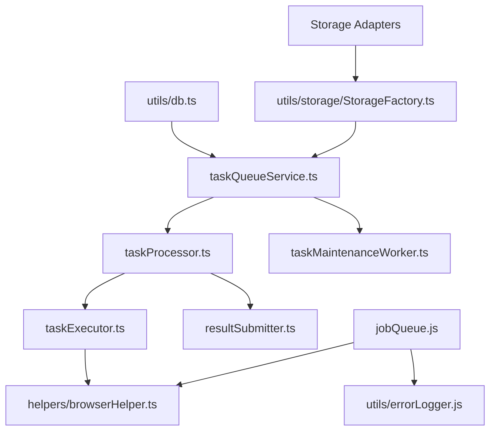

# Phase 3 Services Layer Migration Plan

**Phase:** TypeScript Migration Phase 3  
**Status:** Planning Complete - Ready for Implementation  
**Created:** February 9, 2026

---

## 1. Executive Summary

Phase 3 focuses on migrating the services layer to TypeScript, with emphasis on:

- **6 JavaScript service files** to be converted to TypeScript
- **Dependency-aware migration order** based on service hierarchy
- **Comprehensive type safety** with explicit interfaces for all inputs/outputs
- **Integration testing** for storage adapters migrated in Phase 2
- **Performance benchmarking** before and after migration

---

## 2. Dependency Analysis

### Service Dependency Graph



### Migration Priority (Dependency Order)

| Priority | Service                    | Dependencies                                    | Rationale                                     |
| -------- | -------------------------- | ----------------------------------------------- | --------------------------------------------- |
| **1**    | `taskQueueService.ts`      | utils/db.ts                                     | Foundation - no internal service dependencies |
| **2**    | `resultSubmitter.ts`       | None (uses crypto/https)                        | Independent service                           |
| **3**    | `taskExecutor.ts`          | helpers/browserHelper.ts                        | Depends on migrated browser helper            |
| **4**    | `taskProcessor.ts`         | taskQueueService, taskExecutor, resultSubmitter | Consumes migrated services                    |
| **5**    | `taskMaintenanceWorker.ts` | taskQueueService                                | Depends on migrated queue service             |
| **6**    | `jobQueue.ts`              | browserHelper, errorLogger                      | Legacy - low priority                         |

---

## 3. Type Interface Specifications

### 3.1 TaskQueueService Types

```typescript
// types/taskQueue.ts

export type TaskStatus = 'pending' | 'processing' | 'completed' | 'failed';

export type TaskType = 'website_html' | 'lighthouse_html';

export interface TaskPayload {
  waitUntil?: 'domcontentloaded' | 'networkidle' | 'load';
  timeout?: number;
  handleCloudflare?: boolean;
  useProgressiveRetry?: boolean;
  [key: string]: unknown;
}

export interface Task {
  id: string;
  type: TaskType;
  url: string;
  payload?: TaskPayload | null;
  status?: TaskStatus;
  result?: unknown;
  error?: string | null;
  worker_id?: string | null;
  processing_by?: string | null;
  created_at?: string;
  started_at?: string | null;
  completed_at?: string | null;
  duration_ms?: number | null;
}

export interface TaskStatistics {
  total: number;
  pending: number;
  processing: number;
  completed: number;
  failed: number;
}

export interface TaskQueueConfig {
  logger?: Logger;
  maxConcurrentTasks?: number;
}

export interface TaskQueueService {
  enqueueTask(task: Omit<Task, 'id'>): Promise<string>;
  enqueueBatch(tasks: Array<Omit<Task, 'id'>>): Promise<string[]>;
  getPendingTasks(limit?: number): Promise<Task[]>;
  getTask(taskId: string): Promise<Task | null>;
  updateTaskStatus(taskId: string, status: TaskStatus, metadata?: Partial<Task>): Promise<void>;
  getStatistics(): Promise<TaskStatistics>;
  cleanupOldTasks(olderThanDays?: number): Promise<number>;
  resetStuckTasks(stuckAfterMinutes?: number): Promise<number>;
}
```

### 3.2 TaskExecutor Types

```typescript
// types/taskExecutor.ts

export interface TaskExecutorConfig {
  browserHelper: BrowserHelper;
}

export interface TaskExecutionResult {
  task_id: string;
  type: TaskType;
  success: boolean;
  result?: {
    fileId?: string;
    fileName?: string;
    url?: string;
    fileSizeKB?: string;
    storageType?: string;
    downloadUrl?: string;
    viewUrl?: string;
    [key: string]: unknown;
  };
  error?: string;
  executed_at: string;
  duration_ms: number;
}

export interface LighthouseResult {
  url: string;
  lighthouseVersion: string;
  scores: {
    performance: number | null;
    accessibility: number | null;
    bestPractices: number | null;
    seo: number | null;
  };
  [key: string]: unknown;
}

export interface TaskValidationResult {
  valid: boolean;
  errors: string[];
}
```

### 3.3 TaskProcessor Types

```typescript
// types/taskProcessor.ts

export interface TaskProcessorConfig {
  taskQueueService?: TaskQueueService;
  taskExecutor?: TaskExecutor;
  resultSubmitter?: ResultSubmitter;
  logger?: Logger;
  intervalMs?: number;
  maxConcurrent?: number;
}

export interface TaskProcessorStatus {
  running: boolean;
  activeTasks: number;
  maxConcurrent: number;
  intervalMs: number;
}

export interface ProcessorDependencies {
  taskQueueService: TaskQueueService;
  taskExecutor: TaskExecutor;
  resultSubmitter?: ResultSubmitter;
}
```

### 3.4 ResultSubmitter Types

```typescript
// types/resultSubmitter.ts

export interface ResultSubmitterConfig {
  laravelUrl: string;
  secret: string;
  workerId?: string;
  maxRetries?: number;
  retryDelayMs?: number;
  requestTimeout?: number;
}

export interface SignedPayload {
  task_id: string;
  type: string;
  status: 'completed' | 'failed';
  executed_at: string;
  duration_ms: number;
  worker_id: string;
  processing_by: string;
  result?: unknown;
  error?: string;
}

export interface LaravelResponse {
  statusCode: number;
  body?: unknown;
}
```

---

## 4. Migration Implementation Plan

### 4.1 Step 1: Create Type Definition Files

Create the following type files in `/types/`:

1. `types/taskQueue.ts` - Task and queue types
2. `types/taskExecutor.ts` - Execution result types
3. `types/taskProcessor.ts` - Processor state types
4. `types/resultSubmitter.ts` - Submission types
5. `types/services.ts` - Common service types

### 4.2 Step 2: Migrate Services in Dependency Order

#### Task 1: taskQueueService.ts

**Source:** `services/taskQueueService.js`  
**Dependencies:** `utils/db.ts` ✅

**Key Changes:**

- Convert class to TypeScript with `readonly` properties
- Add explicit parameter types for all methods
- Return typed promises
- Use discriminated unions for task status

```typescript
// Sample implementation pattern
class TaskQueueService {
  private readonly logger: Logger;
  private readonly maxConcurrentTasks: number;
  private activeTasks: Set<string>;

  constructor(config: TaskQueueConfig = {}) {
    this.logger = config.logger || console;
    this.maxConcurrentTasks = config.maxConcurrentTasks || 3;
    this.activeTasks = new Set();
  }

  async enqueueTask(task: Omit<Task, 'id'>): Promise<string> {
    // Implementation with full type safety
  }
}
```

#### Task 2: resultSubmitter.ts

**Source:** `services/resultSubmitter.js`  
**Dependencies:** None (uses built-in Node.js modules)

**Key Changes:**

- Type all configuration parameters
- Create typed interfaces for HTTP responses
- Add proper error types

#### Task 3: taskExecutor.ts

**Source:** `services/taskExecutor.js`  
**Dependencies:** `helpers/browserHelper.ts` (pending migration)

**Key Changes:**

- Type task execution results
- Add discriminated union for task types
- Create validation result type

#### Task 4: taskProcessor.ts

**Source:** `services/taskProcessor.js`  
**Dependencies:** All above services

**Key Changes:**

- Type dependency injection
- Create processor state type
- Add event emitter typing for interval handling

#### Task 5: taskMaintenanceWorker.ts

**Source:** `services/taskMaintenanceWorker.js`  
**Dependencies:** `taskQueueService.ts`

**Key Changes:**

- Type configuration object
- Add state management typing

#### Task 6: jobQueue.ts (Lower Priority)

**Source:** `services/jobQueue.js`  
**Dependencies:** Multiple

---

## 5. Integration Testing Strategy

### 5.1 Storage Adapter Tests

Create comprehensive tests for all migrated storage adapters:

```typescript
// tests/unit/storage-adapters.test.ts

import { StorageFactory } from '../utils/storage/StorageFactory';
import { LocalStorageAdapter } from '../utils/storage/LocalStorageAdapter';
import { BedriveStorageAdapter } from '../utils/storage/BedriveStorageAdapter';

describe('StorageFactory', () => {
  describe('createStorage()', () => {
    it('should create LocalStorageAdapter when STORAGE_TYPE=local', () => {
      process.env.STORAGE_TYPE = 'local';
      const adapter = StorageFactory.createStorage();
      expect(adapter).toBeInstanceOf(LocalStorageAdapter);
    });

    it('should create BedriveStorageAdapter when STORAGE_TYPE=bedrive', () => {
      process.env.STORAGE_TYPE = 'bedrive';
      process.env.BEDRIVE_URL = 'https://example.com/api';
      process.env.BEDRIVE_API_KEY = 'test-key';
      const adapter = StorageFactory.createStorage();
      expect(adapter).toBeInstanceOf(BedriveStorageAdapter);
    });
  });
});
```

### 5.2 Task Queue Service Tests

```typescript
// tests/unit/taskQueueService.test.ts

import { TaskQueueService } from '../services/taskQueueService';

describe('TaskQueueService', () => {
  let service: TaskQueueService;

  beforeEach(() => {
    service = new TaskQueueService({ logger: mockLogger });
  });

  describe('enqueueTask', () => {
    it('should generate task ID when not provided', async () => {
      const task = { type: 'website_html', url: 'https://example.com' };
      const taskId = await service.enqueueTask(task);
      expect(taskId).toMatch(/^[a-f0-9]{32}$/);
    });

    it('should throw error for invalid task', async () => {
      const task = { type: '', url: '' };
      await expect(service.enqueueTask(task as Task)).rejects.toThrow('Task must have type and url');
    });
  });
});
```

---

## 6. Performance Benchmarking Plan

### 6.1 Baseline Metrics

Before migration, establish performance baselines:

| Metric                  | Tool                    | Target          |
| ----------------------- | ----------------------- | --------------- |
| Task Queue Throughput   | Custom benchmark script | >100 tasks/sec  |
| Memory Usage            | Node.js --inspect       | <200MB baseline |
| TypeScript Compile Time | `tsc --noEmit`          | <5 seconds      |
| Test Suite Runtime      | Jest                    | <30 seconds     |

### 6.2 Benchmark Commands

```bash
# Before migration - establish baseline
npm run benchmark -- --phase=baseline

# After each service migration
npm run benchmark -- --phase=migrated

# Compare results
npm run benchmark -- --compare
```

### 6.3 Performance Test Categories

1. **Task Queue Tests**
   - `benchmark:queue:enqueue` - Measure enqueue performance
   - `benchmark:queue:batch` - Measure batch insert performance
   - `benchmark:queue:query` - Measure pending task retrieval

2. **Executor Tests**
   - `benchmark:executor:execute` - Measure task execution time
   - `benchmark:executor:validation` - Measure validation overhead

3. **Compiler Performance**
   - Measure `tsc` incremental compilation time
   - Verify no regressions in watch mode

---

## 7. Code Review Checklist

### Type Safety Requirements

- [ ] No `any` types without explicit justification
- [ ] Generic types used for reusable functions
- [ ] Discriminated unions for state management
- [ ] Readonly properties where appropriate
- [ ] Explicit return types on all public methods

### Error Handling

- [ ] Custom error types for service-specific errors
- [ ] Try/catch with proper error propagation
- [ ] Error logging with context
- [ ] No silent failures

### Async/Await Patterns

- [ ] No unhandled promise rejections
- [ ] Proper await usage (no unnecessary Promises)
- [ ] Timeout handling for long-running operations

### Configuration

- [ ] Configuration objects properly typed
- [ ] Environment variable validation
- [ ] Default values with correct types

---

## 8. Quarterly Documentation Cleanup Routine

### Schedule

- **Frequency:** Quarterly (every 3 months)
- **Trigger:** First week of each quarter
- **Owner:** Documentation lead

### Checklist

1. **Review `/docs/` directory**
   - [ ] Identify outdated documentation
   - [ ] Update migration status in `TYPESCRIPT_MIGRATION_STATUS.md`
   - [ ] Archive superseded guides

2. **Update TypeScript Guides**
   - [ ] Verify code examples compile
   - [ ] Update patterns to reflect current best practices
   - [ ] Remove references to deprecated JavaScript patterns

3. **API Documentation**
   - [ ] Generate updated API docs (`npm run docs:api`)
   - [ ] Verify endpoint descriptions match controllers
   - [ ] Update example requests/responses

4. **Migration Progress**
   - [ ] Update `TYPESCRIPT_MIGRATION_STATUS.md`
   - [ ] Add completed phases to history
   - [ ] Document lessons learned

### Reminder Mechanism

Create a GitHub Actions workflow to send reminders:

```yaml
# .github/workflows/docs-reminder.yml
name: Quarterly Documentation Reminder
on:
  schedule:
    - cron: '0 9 1 1,4,7,10 *' # First day of each quarter at 9am
  workflow_dispatch:

jobs:
  remind:
    runs-on: ubuntu-latest
    steps:
      - name: Send reminder
        run: |
          echo "Quarterly documentation cleanup is due!"
          # Implementation to create GitHub issue or Slack notification
```

---

## 9. TypeScript Compiler Configuration

### Current Configuration Review

The current `tsconfig.json` should be reviewed for:

1. **Incremental Compilation**

   ```json
   {
     "incremental": true,
     "tsBuildInfoFile": ".tsbuildinfo"
   }
   ```

2. **Build Targets**
   - Separate `tsconfig.build.json` for production builds
   - `tsconfig.dev.json` for development with stricter checks

3. **Performance Options**
   ```json
   {
     "skipLibCheck": true,
     "assumeChangesOnlyAffectDirectDependencies": true
   }
   ```

### Recommended Configuration

```json
{
  "compilerOptions": {
    "incremental": true,
    "tsBuildInfoFile": ".tsbuildinfo",
    "skipLibCheck": true,
    "assumeChangesOnlyAffectDirectDependencies": true,
    "composite": true,
    "declaration": true,
    "declarationMap": true,
    "sourceMap": true
  }
}
```

---

## 10. Implementation Timeline

### Week 1: Foundation

| Day | Task                         | Deliverable                           |
| --- | ---------------------------- | ------------------------------------- |
| 1   | Create type definition files | 5 `.ts` files in `/types/`            |
| 2   | Migrate taskQueueService     | `services/taskQueueService.ts`        |
| 3   | Migrate resultSubmitter      | `services/resultSubmitter.ts`         |
| 4   | Write unit tests             | `tests/unit/taskQueueService.test.ts` |
| 5   | Performance baseline         | Benchmark report                      |

### Week 2: Core Services

| Day | Task                          | Deliverable                           |
| --- | ----------------------------- | ------------------------------------- |
| 1   | Migrate taskExecutor          | `services/taskExecutor.ts`            |
| 2   | Migrate taskProcessor         | `services/taskProcessor.ts`           |
| 3   | Write integration tests       | `tests/integration/task-flow.test.ts` |
| 4   | Migrate taskMaintenanceWorker | `services/taskMaintenanceWorker.ts`   |
| 5   | Performance comparison        | Migration impact report               |

### Week 3: Completion

| Day | Task                       | Deliverable                        |
| --- | -------------------------- | ---------------------------------- |
| 1   | Migrate jobQueue (if time) | `services/jobQueue.ts`             |
| 2   | Update documentation       | `TYPESCRIPT_MIGRATION_STATUS.md`   |
| 3   | Code review fixes          | Resolved review comments           |
| 4   | Final testing              | All tests passing                  |
| 5   | Cleanup                    | Remove `.js` files, update imports |

---

## 11. Risk Mitigation

### Risk: Circular Dependencies

**Scenario:** Services reference each other causing circular imports  
**Mitigation:** Use dependency injection, import interfaces not implementations

### Risk: Runtime Errors After Migration

**Scenario:** TypeScript compiles but runtime errors occur  
**Mitigation:** Comprehensive integration tests before removing `.js` files

### Risk: Performance Regression

**Scenario:** TypeScript compilation adds latency  
**Mitigation:** Incremental compilation, benchmark before/after

### Risk: Missing Type Definitions

**Scenario:** Third-party libraries lack TypeScript types  
**Mitigation:** Use `@types/*` packages, create custom types as needed

---

## 12. Success Criteria

### Functional Requirements

- [ ] All 6 service files migrated to TypeScript
- [ ] All existing tests pass
- [ ] New integration tests added for storage adapters
- [ ] No `any` types without explicit justification

### Performance Requirements

- [ ] Task queue throughput >= baseline
- [ ] TypeScript compilation time < 10 seconds
- [ ] No memory leaks introduced

### Code Quality Requirements

- [ ] Code review completed for all files
- [ ] Documentation updated
- [ ] TypeScript strict mode enabled
- [ ] No linting errors

---

## 13. Rollback Plan

If critical issues are discovered:

1. **Keep backup of original `.js` files**

   ```bash
   cp services/*.js services_backup/
   ```

2. **Revert specific file**

   ```bash
   git checkout HEAD -- services/taskQueueService.js
   ```

3. **Verify functionality**
   ```bash
   npm test
   ```

---

## 14. References

### Related Documents

- [`TYPESCRIPT_MIGRATION_STATUS.md`](TYPESCRIPT_MIGRATION_STATUS.md) - Current migration status
- [`docs/API_DOCUMENTATION.md`](docs/API_DOCUMENTATION.md) - API documentation
- [`tsconfig.json`](tsconfig.json) - TypeScript configuration

### External Resources

- [TypeScript Handbook](https://www.typescriptlang.org/docs/)
- [Jest Testing](https://jestjs.io/docs/getting-started)
- [Node.js TypeScript Guide](https://github.com/TypeStrong/node-typescript)
